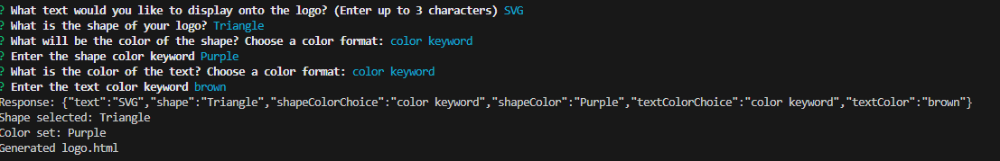

# SVG-logo-maker

## Description
- SVG logo maker for simple 3 word logos with 3 basic shapes Triangles, Circle, Square

## Installation
- Please do npm i in the terminal to download all the dependencies required for this application to function. Followed by npm start to start the logo making proccess 

## Usage
- Upon running " npm start " the terminal will prompt you with a questionaire which you will fill out like so
 
- Upon finishing the questionaire the App will generator a logo.html which will display the logo you made
 
 

## Collaboration
- Collaborations are closed until further notice thank you 

## License
- This application is under the MIT license

## Badges

